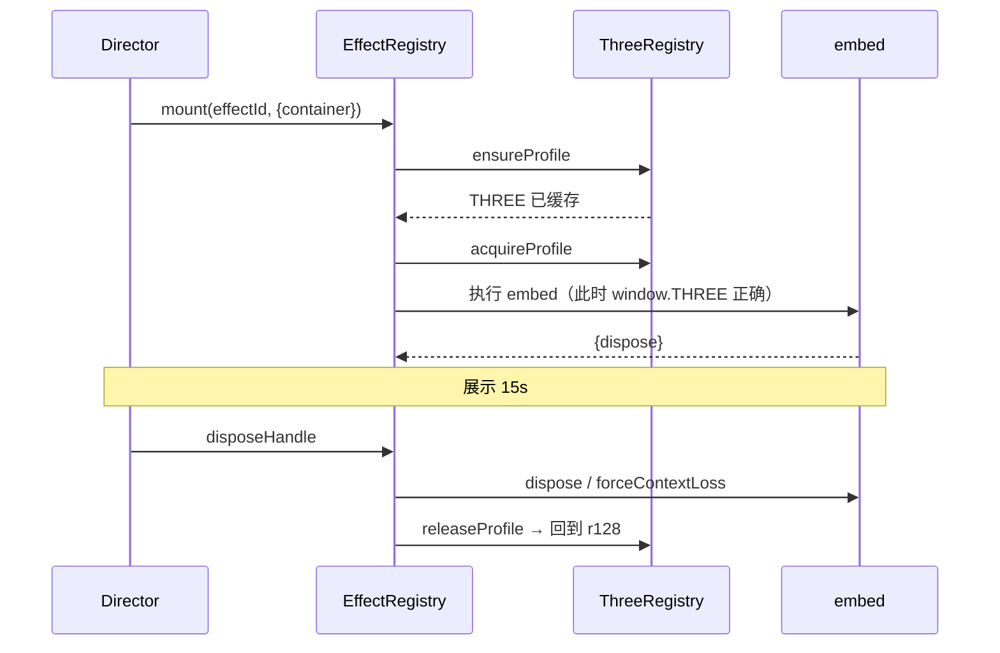

# 专题：版本隔离与特效接入

文件：`app/effects/three-registry.js`、`app/effects/effect-registry.js`。  
说明草稿（合并时的坑）：`reference/INTEGRATION_NOTES.md`。

同一页要跑 r128 房屋、r74 人道/地狱、另一份 r74 畜生、r76 天道、p5 饿鬼。它们都往 `window.THREE` 上写。接错版本的典型症状是**黑屏且不 throw**。

---

## 1. 有哪些 profile

| profile | 脚本 | 缓存全局 | 谁用 |
|---|---|---|---|
| `r128` | cdnjs 的 `three.min.js`（r128）+ jsDelivr 的 GLTFLoader / OrbitControls | `__R128_THREE__` | 房屋、修罗 noise-flow-field |
| `r74-spirit` | `reference/the-spirit/js/three.r74.min.js` | `__R74_THREE_SPIRIT__` | 人道、地狱 |
| `r74-hyper` | `reference/hyper-mix/js/three.r74.min.js` | `__R74_THREE_HYPERMIX__` | 畜生（**另一份 r74，哈希不同**） |
| `r76-love` | `particle-love/three.r76.min.js` + `TweenMax.min.js` | `__R76_THREE_LOVE__` | 天道 |
| `p5` | cdnjs p5 1.4.0 | 不改 THREE | 饿鬼；registry 里触点球也标了 p5 但绘制是 2D canvas |

铁律：**谁的 rAF 在跑，`window.THREE` 必须是谁的构建。** 先 `dispose()` 停循环，再 `releaseProfile()` 拨回 r128。循环未停时切换，`instanceof THREE.Camera` 一类检查会失败，画面静默死掉。

`acquireProfile` / `releaseProfile` 用 `holdCount`。hold>0 且当前是旧版时，其它人调用 `useR128()` 会被挡住，避免房屋预热把正在画的人道 THREE 抢走。注入特效脚本时会 **acquire → 执行 → 立刻 release**（净持有为 0）。真正压住旧版 THREE 的是 `mount` 那一次，直到 `dispose` 才 `release`。不是「注入和展示叠在一起算两次」。

---

## 2. 加载顺序



embed 优先 `fetch` 源码再插入 `<script>` 文本，保证执行瞬间 profile 已 acquire。失败则退回 `script.src`。

`beforeLoad` 钩子：

- **Hyper Mix：** `history.replaceState` 写成 `#amount=524k&motionBlurQuality=high`（脚本执行时读一次 hash）。插入 `.mobile .logo .instruction .footer` 空节点，缺 `.footer` 会在开启动画前 throw。dat.GUI 仍创建，CSS 隐藏，dispose 时 `destroy()`。
- **Particle Love：** 设 `__PARTICLE_LOVE_BASE__` 与 `demoList`。内部模拟点击 High 才真正 `new WebGLRenderer`。原画廊壳（`.logo` / `.menu` / `.quality-selector` / iframe）仍会建 DOM，embed 自己的 CSS 设 `display:none`；点 logo 原本会 iframe 打开外站，主流程点不到。

---

## 3. 统一挂载约定

每个视觉一个文件夹 `reference/<name>/`，暴露：

```js
window.mountXxx = function (opts) {
    // opts.container 必填
    return { dispose: function () {}, collapse: function () {} /* 可选 */ };
};
```

`EFFECT_DEFS` 一项：

```js
'the-spirit': {
    kind: 'path',              // stage | path | unused
    threeProfile: 'r74-spirit',
    scripts: ['../reference/the-spirit/js/the-spirit-embed.js'], // 改 embed 时给这条加 ?v=
    mountName: 'mountTheSpirit',
    needsMouseMove: false,
    wrapCanvasGlow: false,     // 饿鬼为 true
    beforeLoad: optionalFn,
}
```

导演只认 `effectId` 字符串。`assigned-path` 在分镜里不是具体 id，由 `PATHS_CONFIG` 翻译。

`mouse-black-hole` 已登记 `kind: 'unused'`，主流程不 mount。

---

## 4. 必踩的坑

**天道静默黑屏。** `reference/particle-love/images/logo.png`（以及 `motion_blur.png`）必须可访问。原 loader 只有 `onload`，404 时初始化永久卡住，无 `onerror`、无 console。查 Network 是否 404，不要只看 WebGL 扩展。

**两份 r74 不能混。** spirit 为 `74dev`，hyper 为 `74`。缓存变量必须分开。

**GPGPU 单例。** 人道 / 地狱 / 畜生内部模块往往没有完整 GPU 析构。dispose 里 `forceContextLoss()`。同一页不要高频反复 mount。冷启动着色器：spirit 约 200–270ms；修罗首次编译约 1.3s（5 阶 4D noise）。展场显卡与上下文上限见 [展场与设备限制](./专题-展场与设备限制.md)。

**不要改主流程不跑的文件。** `iris-wipe.js`、CoinGecko `run()`、`PATH_CONFIG.condition` 清单见 [预览页与验收](./专题-预览页与验收.md)。

**r76 → r128 移植未完成。** `reference/particle-love/experimental-r128-wip/` 修了 `addAttribute` 和 PhysicalMaterial uniform，仍全透明黑。生产必须继续用 r76 切换方案。

**blob 预取 GLB。** 仅 r128 打了 FileLoader 补丁；旧版特效不要走 blob 加载房屋。

---

## 5. 新接一套特效的清单

1. 文件夹放进 `reference/`，实现 `mountXxx` / `dispose`。
2. 若依赖旧 Three：比对 SHA256，能复用现有 r74-spirit / r74-hyper / r76 就复用，否则新 profile + 新缓存名。
3. `EFFECT_DEFS` 加一项。
4. 若是六道：`PATHS_CONFIG` 改 `effectId`。用哪份 Three 以 `EFFECT_DEFS.threeProfile` 为准（`PATHS_CONFIG.threeProfile` 目前没人读）。
5. 静态图、字体一并拷贝；用 Network 确认无 404。
6. 若该特效文件夹里有 `compat-test.html`，先单独验证 r128 → 该版本 → r128。现有：`the-spirit`、`constraint-particles`、`hyper-mix`、`particle-love`。修罗、饿鬼、触点球**没有**这份页。
7. 改了 embed：给 `EFFECT_DEFS.scripts` 里那条 URL 加/改 `?v=`，并 bump `effect-registry.js?v=`（index.html 只认 registry）。改了 profile 脚本列表再 bump `three-registry.js?v=`。只 bump registry、embed 的 URL 没变，`fetch` 仍可能拿缓存。

触点球 `repel-particles` 是 **Canvas 2D**，registry 仍标 `threeProfile: 'p5'`，进 Stage 2 就会把 p5.js 从 CDN 拉下来（饿鬼稍后能复用）。embed 里不要假设已经 `new p5(...)`。它提供 `collapse()` 给 blocking `postClick`。

---

## 6. 用厨房解释「为什么要切 THREE」

把 `window.THREE` 想成灶台上只能放一把菜刀，刀柄都刻着同一个品牌名。2015 年的刀（r74）和 2020 年的刀（r128）外形都叫菜刀，但刀刃卡口不同。人道那道菜的菜谱写着「用 2015 的刀切，并且边切边看刀柄上的品牌是不是 THREE」。如果你切到一半把刀换成 2020 的，菜谱一检查「这不是我要的那把」，不会爆炸，只是不再往锅里下菜——屏幕就黑了。

所以规矩是：

1. 平时灶台上放 r128（房屋在用）。
2. 上六道某一道之前，把正在炒的房屋停火（`suspend` 停 rAF）。
3. 换成那道菜指定的刀（`acquireProfile`）。
4. 开火 15 秒。
5. 停火、洗碗（`dispose`，有时还要 `forceContextLoss` 把锅底刮干净）。
6. 把 r128 放回灶台，再炒「生」的点云。

p5 饿鬼不抢菜刀，它用案板（2D canvas）。修罗用的就是 r128 这把刀，所以最省事。

两份都写着 r74 的刀其实还不是同一把（spirit 的 74dev 和 hyper 的 74）。拿错会切不动。缓存必须分三个抽屉：spirit、hyper、love。

天道还有一个不是刀的问题：菜谱第一步是「先看见 logo 照片再开火」。照片 404 时，老菜谱只等照片永远不来，也不喊。于是你以为 WebGL 坏了，其实是少了一张 png。见素材专题。

非技术人员若只想「换六道里某一道的气质」，不要去改 Three 版本。去 `paths.config.js` 把 `effectId` 换成已经存在的另一种（例如把人换成修罗的 noise-flow-field）。那是配置，不是接新库。接新库必须走第 5 节清单，并准备好黑屏两小时。

预览某一道用 `?path=` 见六道专题末尾。预览时若房屋和特效叠在一起，说明导演的 suspend 没跑到——`path=` 会跳 Stage 11，正常不应再看见房子。若看见房子，是 bug，查 `HouseModelStage.suspend`。
