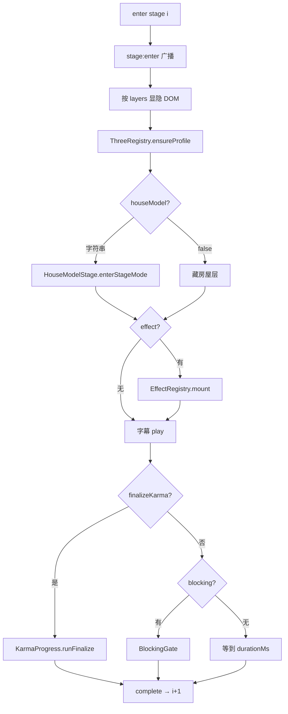

# 专题：舞台导演与配置

文件：`app/core/stage-director.js`、`app/config/stages.config.js`、`app/core/blocking-gate.js`、`app/core/event-bus.js`、`app/core/subtitle-controller.js`、`app/ui/house-hint.js`。

总览里只说「按表切段」。本篇写表里有哪些字段、导演一轮做什么、三种等待怎么实现、事件谁发给谁。

---

## 1. 分镜表长什么样

`STAGES_CONFIG` 是一个数组，下标 0–14。导演用下标往前走，不按 `id` 跳（调试跳段是 `main.js` 把 `startIndex` 设成 N）。

每段常见字段：

| 字段 | 作用 |
|---|---|
| `id` / `key` | 编号与短名，提示和房屋 mode 用 key |
| `durationMs` | 到点自动结束；`null` 表示不靠秒数 |
| `blocking` | `null` 或 `{ type, afterMs, count, postClick }` |
| `subtitles` | 数组，或 `'six-paths-fixed'`，或受段由 vedana 覆盖 |
| `layers.bgVideo` | 星空 video 是否可见（六道为 false，实际只是透明） |
| `layers.effect` | `null` / `'repel-particles'` / `'assigned-path'` |
| `layers.houseModel` | `false` 或 mode 字符串：`expand` `particleize` `six-circles` `chu` `shou` `ai` `qu` `phase` `fade` |
| `layers.karmaBar` | 是否显示进度条 HUD |
| `threeProfile` | `'r128'` `'p5'` `'dynamic'`（六道按特效定义） |
| `collectInteraction` | 表里写了，**没有任何脚本读取**。采集起停见第 7 节 |
| `finalizeKarma` | 仅「有」段：走进度条并 `finalizeSession` |
| `karmaDurationMs` / `karmaResolvedHoldMs` / `karmaLabel` | 7s / 5s / 文案 |
| `handledByMain` | 表里写了，**没有人读**。导演从 1 开始是因为 `main.js` 点完雪花后 `startIndex: 1` |
| `playNotesOnClick` | 表里写了，**没有人读**。六入音符在房屋里直接 `playNote` |

台词一条：`{ text, atMs, fadeDelayMs? }`。`durationMs` 常写在表里，**字幕控制器不读**。到点调用 `showLine`：先去掉 `.active`，再等 `fadeDelayMs`（缺省 800ms）才换字淡入。**字出现的时刻是 `atMs + fadeDelay`**，不是 `atMs` 本身。识/名色/触/受/爱/取写了 `fadeDelayMs: 0`，所以几乎对准 `atMs`。触点球、生、老死、六道固定句没写 0，第一句会晚约 0.8s 才看见。`fadeDelayMs: 0` 则马上换。

受段：`key === 'house-shou'` 时导演丢掉表里的默认句，改用 `VEDANA_SUBTITLES[currentVedanaKind]`。六道段：`subtitles: 'six-paths-fixed'` 换成 `SIX_PATHS_SUBTITLES`（六道同一句）。

`layers.effect === 'assigned-path'` 时，导演 `peekPathId()` → `PATHS_CONFIG[id].effectId`。`threeProfile: 'dynamic'` 则跟该 effect 在 registry 里的定义走（**不是** `PATHS_CONFIG.threeProfile`）。

---

## 2. 导演一轮（简化）

`houseModel: false` 只是把 `#houseLayer` 藏起来，**不会** `suspend`。`suspend({ keepVisible })` 只发生在进六道（停房屋 rAF，把屏幕让给特效）。

Stage 11 额外：Stage 10 就可预热 assigned-path 的脚本；进 11 时房屋层再淡出 `PATH_FADE_MS=700`、挂 HUD、把 video 透明度打到 0。结束若下一段是 `woven-ring`：先 dip **3s 入黑** → 全黑后 `dispose` 六道并 `enterStageMode('phase')`（video 按表重新可见）→ **再等 80ms** → **3s 出黑**。字幕等出黑开始才播。常量：`DIP_OUT_MS=3000`、`DIP_IN_MS=3000`、`DIP_HOLD_MS=80`。12→13 时房屋 `fadeFromPhase` 为真，老死会叠还未收完的编织波，避免硬切。

`peekPathId()` 优先级：URL 强制 `__PATH_OVERRIDE__` → 已有 `karmaResult.finalPath` → 算法 `peekLeadingPath` → 默认 `'ren'`。

---

## 3. 阻塞门

`blocking-gate.js` 返回 Promise，导演 `await` 之后才进入 duration 或下一段。

| type | 行为 |
|---|---|
| `click` | 捕获阶段听一次 document click |
| `click-after` | 先 `waitMs(afterMs)`，再 `blocking:ready`，再等 click。Stage 2 的 `hitTest` 是画布中心圆：半径 = 球当前半径 + 6px（球半径约短边的 16%）；点偏了不算。`postClick` 调特效 `collapse()`（约 650ms 萎缩） |
| `six-nodes` | 听一次 `liuru:complete`（房屋点亮 6 个后约 480ms 才发）。配置里的 `count` 不参与计数 |
| `clicks` | 任意点击计数（表里没用） |
| `sequence` | 先等 introMs 再点；表里没用。blocking-ui 会在 `ready` 时乱画六个圆，主流程六入不走这条 |

Stage 0 的 click 在 `IntroController`，不走这段导演循环。

`blocking-ui.js` **不听** `blocking:mode`。导演里虽有「`layers.blockingUi` 为真则 `setMode`」的分支，正赛分镜目前只写 `null`，这条**不会**跑。触点球 4 秒后靠 `blocking:ready`（`click-after`）画出声纳并显示奇点提示。六入热区是房屋自己投影的 DOM，不在 blocking-ui 里画六个圆（那套 `showSixCircles` 是给未使用的 `sequence` 的）。

---

## 4. 事件总线

`AppEventBus`：同步数组，`emit` 当场调用，无队列、无回溯。

| 事件 | 谁发 | 谁听 |
|---|---|---|
| `stage:enter` | 导演 | 提示换词库；面板若进「取」则开始 3s 淡出 |
| `stage:complete` / `stage:exit` | 导演 | **目前没有监听者**（导演自己在 complete 后调用 `exitStage`） |
| `sutra:complete` | 经文 | 面板 show |
| `market:tick` | 行情 | 面板刷新 |
| `market:connected` / `disconnected` / `tick-error` | 行情 | 目前几乎只打事件，**断线不会自动重连** |
| `karma:finalize-start` | 进度条开始 | 面板 hide |
| `karma:finalized` | 进度条 100% | 面板内部更新（已隐藏） |
| `liuru:node` / `liuru:complete` | 房屋 | 阻塞门等 complete（点亮第 6 个后再等约 480ms 才发 complete）。音符是房屋里直接 `playNote`，不是听这个事件 |
| `blocking:mode` / `ready` / `click-progress` | 门 | `ready` 给奇点 UI；`click-progress` 给未使用的「点 N 次」；六入音符不走这里 |
| `shou:vedana` | 导演进受时 | **目前没有监听者**。房屋苦乐舍靠 `enterStageMode('shou', { vedanaKind })`，不靠这条事件 |
| `director:finished` | 导演走完 14 | **目前没有监听者** |

新模块不要直接互相 `require`（也没有模块系统），对上表发事件即可。

---

## 5. 图层与 DOM

`index.html` 里预先写好的层，导演只改 `hidden` / 样式，不动态创建主画布容器以外的壳：

- `#globalBgVideo` 星空
- `#introScreen` `#sutraQuoteStage` `#finalQuoteStage`
- `#effectLayer` `#houseLayer`
- `#karmaHud` `#subtitleLayer` `#houseHint` `#singularityHint`
- `#pathResolutionHud` `#blockingLayer`

业力面板是 `KarmaDataPanel` 运行时 `append` 到 `body` 的。星空在 `bgVideo: false` 时仍播放，只把透明度打没，切回「生」才不会卡视频解码。

---

## 6. 字幕与操作提示

字幕：`#subtitleLayer`，按 `atMs` 切换。特效段要等 `mount` 的 Promise，避免台词比 WebGL 先出。

提示 `house-hint.js`：2.4s 一闪，周期在 **CSS** `hintPulse`，不是 `houseHintCycleMs`。识进名色不重开同一数组；四句两轮共约 19.2s 跨两段。六入两句循环到点完；触一句循环；受把四句各闪一轮盖满 9.6s；取一句三轮；六道仅人/畜/饿有句。按 `stage:enter` 的 `key` 与 `pathId` 换词库。

---

## 7. 和业力的交接点

- Stage 0 完成后才 start 采集与 WS（`main.js` 的 `onIntroComplete`），不是导演里 start。导演里有个 `onSessionStart`（采集、行情、`NoteAudio.unlock`），**从未被调用**。
- `collectInteraction` **不控制**采集。正常流程：点雪花 `start()`，进度条走到 100% `stop()` 并 `finalizeSession`。之后再点也不会改已经锁死的道。要重算只能点 Begin again（跳到无查询参数的 pathname）。
- Stage 7：`resolveVedanaKind(peekPathId())` → `enterStageMode('shou', { vedanaKind })`。
- Stage 10：`finalizeKarma` → `runFinalize` → 内存 `karmaResult`。
- Stage 11：`assigned-path` 用最终 pathId；HUD `PathResolutionHud.show`。

改时长优先改表，不要在导演里写死秒数。黑场毫秒数目前写在导演常量，改过渡要动 `stage-director.js` 并 bump `?v=`。

---

## 8. 十五段对照表（改分镜时对着看）

Stage 0 由 `IntroController` 处理，导演从 1 起。时长为约数。

| id | key | 结束条件 | house | effect | 采集 |
|---|---|---|---|---|---|
| 0 | intro-snowflake | 点雪花 | 无 | 无（雪花 canvas） | 点完才 start |
| 1 | diamond-sutra | 等字体后约 8s 显现 + 0.15s + 5s 停，或点经文跳过 | 无 | 无 | 是 |
| 2 | repel-touch | 4s 后点中心 `collapse` | 无 | `repel-particles` | 是 |
| 3 | house-expand | 9.6s | `expand` | 无 | 是 |
| 4 | house-particleize | 9.6s | `particleize` | 无 | 是 |
| 5 | capturing-six | 一次 `liuru:complete`（第 6 点后再约 480ms） | `six-circles` | 无 | 是 |
| 6 | house-chu | 9.6s | `chu` | 无 | 是 |
| 7 | house-shou | 9.6s | `shou` + vedana | 无 | 是 |
| 8 | house-ai | 8s | `ai` | 无 | 是 |
| 9 | house-qu | 7.2s；面板开始 3s 淡出 | `qu` | 无 | 是 |
| 10 | karma-collapse | 进度条 7s + 文案 5s | 仍 `qu` | 无 | 是，结束时 stop |
| 11 | six-paths-reveal | 15s 后黑场 | 无（suspend） | `assigned-path` | 否 |
| 12 | woven-ring | 6s | `phase` | 无 | 否 |
| 13 | uninstall-fade | 11s | `fade` | 无 | 否 |
| 14 | final-quote | 点 Begin again（跳到无参数 pathname） | 无 | 无 | 否 |

`startMarketSession` 写在 Stage 0 配置上，真正 `MarketTicker.start()` 在 `main.js` 点雪花回调里。

若要加第 16 段：在数组末尾加一项，处理 `duration`/`blocking`/`layers`，并考虑 14 目前是开放结尾（`FinalQuoteController` 自己 listen 按钮）。不要插在中间除非你愿意改所有 `?stage=N` 调试习惯。

---

## 9. 把导演想成司仪，不要想成编剧

司仪手里只有一张单子：现在请房屋出场、请特效出场、请大家鼓掌（等点击）、请静默若干秒。单子在 `stages.config.js`。司仪代码几乎没有「如果观众是修罗就少等两秒」这种创作，创作写在表上和房屋/特效内部。

你若只改英文台词：先确认这句话是不是底部叙事。是，才打开分镜表找 `text: '...'`。开场标题、金刚经、终章大字不在这张表，见 [屏幕上看到什么](./专题-屏幕上看到什么.md)。保存后给对应文件的 `?v=` 加一。不要在 `stage-director.js` 里搜索那句英文——导演不存台词正文，只存「去表里取」。

你若觉得某一段「太快」：改该段 `durationMs`。六入没有 duration，再快也要等 6 个点。触点球再快也要等 4 秒后的那一次点击。业力条再快也要改 `karmaDurationMs`，那 7 秒同时是最后的记账窗口。

改表里的 `collectInteraction` / `handledByMain` / `playNotesOnClick` 不会改变行为。采集窗口是「雪花点击 → 进度条 100%」，与这几个字段无关。
