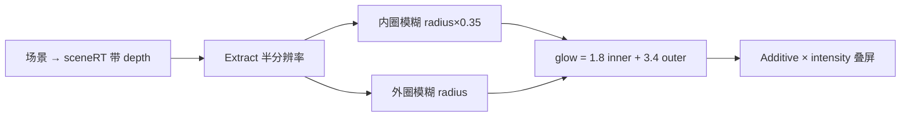

# 专题：辉光与黑场

文件：`app/effects/ae-glow.js`、`app/effects/canvas-ae-glow.js`、`app/effects/dip-fade.js`。  
房屋里调用：`house-model-stage.js` 的 `renderHouse()`。饿鬼：`EffectRegistry` `wrapCanvasGlow: true`。黑场：`stage-director.js` 在六道 → 生。

---

## 1. 为什么要自写 Glow

Three r128 没有内置「AE 那种阈值辉光」。房屋是透明点云叠星空，用现成 UnrealBloom 容易把整屏洗白。自写管线只提取够亮的像素，模糊后再加回去，参数按 AE 面板对齐：**Threshold 10 → 代码 0.10，Softness 0，Radius 26，Intensity 0.7，Colorize 关**。

---

## 2. AeGlow 管线

全屏三角形：正交相机 + `PlaneBufferGeometry(2,2)` + 若干 `ShaderMaterial`，`depthTest/Write` 关。

**Extract。** 先把预乘透明除回直通色，再 Rec.709 亮度：

\[
Y = 0.2126 R + 0.7152 G + 0.0722 B
\]

Softness \(< 0.0005\) 时 \(m=\mathbf{1}_{Y\ge \tau}\)（\(\tau=0.10\)），否则 `smoothstep(\tau-s,\tau+s,Y)`。再乘 \(\alpha^{0.55}\) 压薄半透明点。Colorize=0 时用原色；开时染成 `colorA`（默认 `0x7ED4DE`，主流程关闭）。

**Blur。** 9-tap 高斯，权重：

\[
0.016216,\;0.054054,\;0.121621,\;0.194594,\;0.227027
\]

（两侧对称。）可分离：先水平再垂直，并且 **做两轮**，第二轮方向乘 1.65，相当于加宽核。内圈 RT 为画布一半，外圈四分之一。`radius` 换算成纹理像素偏移。

**合成。**

\[
\mathrm{rgb}=(1.8\cdot\mathrm{inner}+3.4\cdot\mathrm{outer})\times \mathrm{intensity}
\]

`AdditiveBlending` + premultiplied alpha。`glowOnly` 时只画光不画原图（调试用）。

`render(scene, camera, { clearScreen })`：先渲到 `sceneRT`，copy 到屏幕（可 overlay 不清屏），再 `_applyGlow`。房屋 mesh+点同时在时，第一次 `enabled=false` 画 mesh，第二次 `clearScreen:false` 画点云光，避免墙面开花。

`resize()` 按 renderer 尺寸 × pixelRatio 重建全部 RT。窗口变化必须调。

---

## 3. 2D canvas 套同一套光

饿鬼是 p5 的 2D canvas，没有 Three 场景。`wrapCanvasAeGlow`：

1. 在容器里找到非 overlay 的源 canvas。
2. `THREE.CanvasTexture(src)`，`flipY=true`，线性过滤、关 mipmap。
3. 另建一个 r128 renderer + 正交一张平面，`AeGlow` 绑在这个 renderer 上。
4. 每帧 `texture.needsUpdate=true`，源 canvas `opacity:0`，只显示 overlay。
5. 分辨率跟源 canvas 的 backing store；CSS 尺寸跟 clientWidth。

`lineRgb` 传给 **p5 的 `mountParticleRing`**（粒子和环描边），不是传给 `wrapCanvasAeGlow`。registry 缺省用房屋 `getCloudColorRgb()`，也就是 `COL_HOUSE` 拆开的 `(0x3A, 0x6D, 0x75)`。Glow 自己仍用 `AeGlow.DEFAULTS`。预览白线 tab 不传 `lineRgb` 则环保持白。

dispose 要停 rAF、dispose texture/renderer/glow，并把源 canvas opacity 恢复。

---

## 4. 房屋何时开光

`aeGlowAllowed()`：

- `suspended`（六道占屏）关
- mode `expand`（实体识）关
- mode `ring-flow` 关
- 其余：点云 `uPointAlpha > 0.02`

名色 dual 阶段点和 mesh 可同时在，走「先 mesh 后点+光」。

调参：改 `AeGlow.DEFAULTS` 或构造参数。Threshold 升高 → 只有更亮的点开花；Radius 加大 → 光斑更散；Intensity 是总增益。Softness>0 会让阈值边缘变软，当前正式为 0（硬切）。

---

## 5. 黑场 dip-fade

不是 WebGL。一层 `position:fixed; inset:0; z-index:80; background:#000`。rAF 改 opacity。十字光标 z-index 是 **9999**，黑场盖不住它，全黑时仍能看见那枚 40px 十字跟着鼠标走。

缓动：

\[
\mathrm{inBlack}(t)=t^2,\qquad \mathrm{outBlack}(t)=1-(1-t)^2
\]

导演：出 3000ms 入黑 → **全黑后** dispose 六道、`enterStageMode('phase')`、按表恢复 video 可见 → **再 hold 80ms** → 入 3000ms 出黑。`pointer-events:none`，不挡终章按钮（那段不用黑场）。80ms 不是「用来 dispose 的窗口」，dispose 发生在这 80ms **之前**。

为什么不用 CSS transition：要在 opacity===1 的那一帧精确换层，rAF 数字可靠。Iris 擦除曾做过预览（`iris-wipe.js`），**主流程未接**，不要和 dip 搞混。

---

## 6. 改完 bump

`ae-glow.js?v=`、`canvas-ae-glow.js?v=`、`dip-fade.js?v=`、房屋若改了调用方式还要 bump `house-model-stage.js` 与 `stage-director.js`。

---

## 7. 调光时人眼对照

把 Glow 想成拍照的「只把高光抹糊再叠回去」，不是给整张图打雾。

- 点看起来没光、发干：Threshold 太大（0.10 再高就只剩最亮的芯）或 Intensity 太低。先动 Intensity。
- 星空和字幕一起开花：Threshold 太小，或 Colorize 误开。主流程 Colorize 必须为 0。
- 光斑方、有拖影砖块：Radius 相对分辨率太大，或没在 resize 时重建 RT。
- 饿鬼有光但位置错位：源 canvas 和 overlay 尺寸不同步，检查 `wrapCanvasAeGlow` 的 `syncSize`。
- 识那一段房屋发晕：不该开 glow；若开了，查 `aeGlowAllowed` 是否把 `expand` 排除漏了。

黑场不要做成 CSS `opacity` 动画另写一套，否则导演无法保证「全黑那一帧」才换层。两套动画抢，会出现星空和六道叠半秒——这是当初不用 iris、改 dip 的原因。

---

## 8. 不要用 AE 工程直接套

AeGlow 只仿了 Glow 这一个效果的「提亮、糊、叠」。没有 AE 的图层时间线、没有预合成、没有表达式。房屋点的运动是 JS 和着色器算的，光只是画完之后的一层滤镜。把 AE 工程里的 Threshold 10 填进代码的 0.10，是因为我们按预览页对过眼睛，不是因为文件格式兼容。

改 Radius 不必懂 shader：打开 `ae-glow.js` 顶部 `DEFAULTS.radius`。改完 bump `?v=`。若只想看光不想走完全场：`app/preview/glow-preview.html`（实验室页，正式入口没有链接）。饿鬼套光用同一组 DEFAULTS，改一处两处一起变。若只想改饿鬼、不动房屋，要给 `wrapCanvasAeGlow` 传独立 opts，那已经是改 registry 代码。
