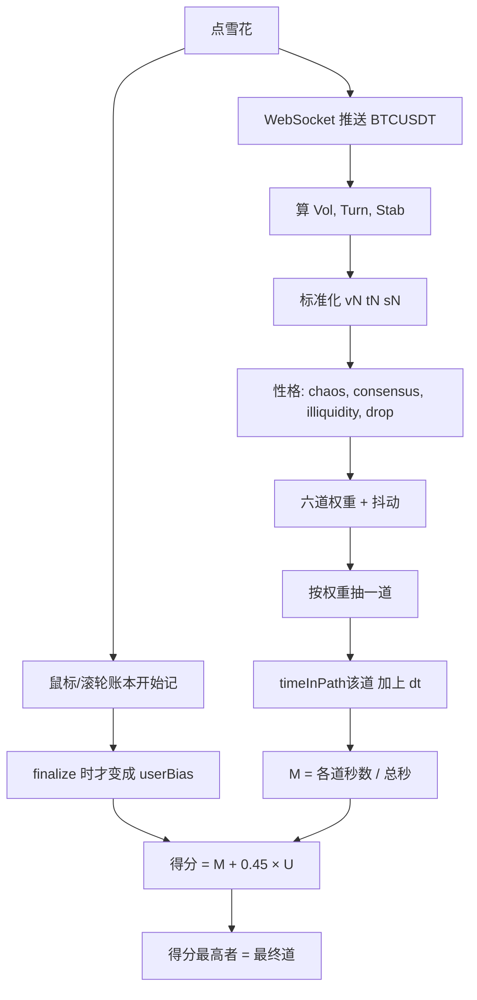

# 专题：业力计算系统

> 归道算法专题。右上角「業力計算系統」只是仪表，真正算道的是 `app/karma/six-paths-algorithm.js`。  
> 目录：[README](./README.md) · 总览：[总览.md](./总览.md)

**零基础可以先读完本节就停。** 后面的公式是给要改权重的人。

从点那颗光点到进度条走完，程序同时记两本账：

1. **行情：** 公共的比特币价格心跳（谁来看展都是同一份盘）。每隔一会儿抽到六道中的一道，把这段时间记在那一道上。
2. **你的手：** 点、移、滚。转房子算「看」，不算躁。光点那一下发生在采集开始之前，不算进点击账。过关必须点的奇点和六个圈（以及可能跳过经文的一下）大体落在仪式 8 次以内；额外狂点才会抬高「活跃」。

进度条到 100% 时两本账合成一个分数：市场时间为主，手可以在两道接近时翻盘，很难单靠手把从没待过的道拉成第一。分数最高的那一道，在接下来 15 秒全屏播放。经文后右上角：**饼/条是各道已经堆了多久（\(T_k/T_{\mathrm{tot}}\)）**；左上 logo / Current Tendencies 才是**这一包刚抽中的道**。两样都不是最终判决。「受」看见的苦乐也可以和最终道不同——后面还有 7 秒继续记账。

没有投资建议、没有上传观众姓名。展场网断了可以用 `?market=mock` 假盘，见排障专题。

---

## 1. 整条管道

**时间边界（必须按这个停表，否则账是错的）：**

- **开始：** 雪花点击（`INTERACTION_COLLECTOR.start` + `MarketTicker.start`）。
- **偷看（不锁死）：** 第 7 段「受」调用 `peekLeadingPath`，会话继续。
- **结束：** 第 10 段进度条到 100%（约 7 秒走完）。此时 `stop` 采集、关掉 WebSocket，再 `finalizeSession`。

进度条那 7 秒里行情和鼠标**仍在记账**。所以「受」看见的道，不必等于最终道。

---

## 2. 行情侧：从币安一包到三个因子

连接：

`wss://stream.binance.com:9443/ws/btcusdt@ticker`

每来一条 JSON，取出：

| 符号 | 币安字段 | 含义 |
|---|---|---|
| \(P\) | `c` | 最新价（USDT） |
| \(H\) | `h` | 24 小时最高 |
| \(L\) | `l` | 24 小时最低 |
| \(V\) | `q` | 24 小时成交额（报价货币，USDT） |
| \(\Delta_{24}\) | `P` | 24 小时涨跌幅，单位已经是 **百分比**（例如 `-2.5` 表示跌 2.5%） |

市值不是交易所官方接口，而是配置里的流通量乘价格：

\[
MC = S \times P,\qquad S = 19\,900\,000
\]

（`assets.config.js` 的 `circulatingSupply`。改 S 会改变 Turn 和 Stab，等于改「体量尺子」。）

**不要随便把交易对从 BTCUSDT 换成别的币。** 标准化分母（Vol/18、Turn/0.06、Stab 从 9 到 14）是按比特币这种大体量、中等波动来的。小币 Turn 和 Vol 经常顶满，六道会挤向修罗/畜生/地狱。若一定要换：同时重做第 3 节分母，并用平静日/暴跌日/mock 各跑多场看分布。改 `binanceSymbol` 却不改公式，等于没调参。这不是投资模块，只是采样公共心跳。

三个因子：

\[
\mathrm{Vol} = \frac{H - L}{L} \times 100
\qquad\text{（日振幅百分比；} L\le 0 \text{ 则 } 0\text{）}
\]

\[
\mathrm{Turn} = \frac{V}{MC}
\qquad\text{（换手；} MC\le 0 \text{ 则 } 0\text{）}
\]

\[
\mathrm{Stab} = \log_{10}(MC)
\qquad\text{（市值越大越「沉」）}
\]

面板上的换手有时乘 100 显示成 %，算法内部用的是 **未乘 100 的比值**。不要把面板上的 `2.3%` 直接当成 `Turn=2.3` 代入，那会大两个数量级。

---

## 3. 标准化与四种「性格」

先把因子压进 \([0,1]\)，避免某一天 Vol=40 把后面全部撑爆：

\[
v_N = \mathrm{clamp}\!\left(\frac{\mathrm{Vol}}{18},\; 0,\; 1\right)
\]

\[
t_N = \mathrm{clamp}\!\left(\frac{\mathrm{Turn}}{0.06},\; 0,\; 1\right)
\]

\[
s_N = \mathrm{clamp}\!\left(\frac{\mathrm{Stab}-9}{5},\; 0,\; 1\right)
\]

\(\mathrm{clamp}(x,0,1)=\min(1,\max(0,x))\)。含义：Vol 到 18% 顶满；Turn 到 0.06 顶满；Stab 从 9 到 14 走完 0→1（比特币市值对数通常落在这附近）。

四种性格：

\[
\begin{aligned}
\mathrm{chaos} &= 0.6\, v_N + 0.4\, t_N \\
\mathrm{consensus} &= s_N \\
\mathrm{illiquidity} &= 1 - t_N \\
\mathrm{drop} &= \max\!\left(0,\; -\frac{\Delta_{24}}{28}\right)
\end{aligned}
\]

\(\mathrm{drop}\)：只有下跌才大于 0；跌 28% 才等于 1。涨的日子 \(\mathrm{drop}=0\)，地狱权重主要靠 chaos。

---

## 4. 每一包如何抽一道（加权随机，不是 if-else）

文件里 `PATH_CONFIG[].condition` 写过硬门槛（例如「跌超 15% 进地狱」），**现行代码不调用它们**。现行是六道各算一个正权重，加噪声，再按比例抽签。

### 4.1 基础权重

\[
\begin{aligned}
w_{\text{天}} &= 1 + 0.8\,\mathrm{consensus} - 0.35\,\mathrm{chaos} \\
w_{\text{人}} &= 1.15 + 0.45\bigl(1 - |\mathrm{chaos}-0.45|\bigr) \\
w_{\text{修}} &= 1 + 0.55\,\mathrm{chaos} + 0.25\, t_N \\
w_{\text{畜}} &= 1 + 0.7\,(1-\mathrm{consensus})\, t_N \\
w_{\text{饿}} &= 1 + 0.7\,\mathrm{illiquidity}\,(1-\mathrm{consensus}) \\
w_{\text{狱}} &= 1 + 0.45\,\mathrm{chaos} + 0.55\,\mathrm{drop}
\end{aligned}
\]

读法：天喜欢「沉且不吵」；人在 chaos 靠近 0.45 时最高（日常带一点波动）；修罗吃吵和换手；畜生吃「体量轻 × 换手高」；饿鬼吃枯竭且轻；地狱吃吵和暴跌。

### 4.2 抖动（让同一秒盘面也能进邻道）

对每个 \(w\)，抽一个均匀随机数 \(U\sim \mathrm{Uniform}(0,1)\)：

\[
w' = \max\bigl(0.1,\; w \cdot (1 + 0.2(U-0.5))\bigr)
\]

即相对乘上 \([0.9,\; 1.1]\)，再保底 0.1。没有保底时，某一道权重可能被压到接近 0，整晚抽不中。

### 4.3 抽签

令 \(W=\sum w'\)。抽 \(r\sim \mathrm{Uniform}(0,W)\)，按固定顺序累加前缀和，第一次超过 \(r\) 的道胜出：

**天 → 人 → 修罗 → 畜生 → 饿鬼 → 地狱**

这不是「权重最大者必中」，而是「权重大者概率高」。连续 100 包，占比会接近权重比，单包仍可能跑偏。

### 4.4 把时间记在抽中的那一道

\[
T_k \leftarrow T_k + \Delta t,\qquad
T_{\mathrm{tot}} \leftarrow T_{\mathrm{tot}} + \Delta t
\]

\(\Delta t\) 是本包时间戳减去上一包，单位秒，下限约 0.001，第一包默认 1。  
**推送稀疏时，一包可能代表 10 秒，那一道会在饼图里突然变厚。** 这是设计：时间才是市场票数，不是包数。

同时做时间加权的因子和：

\[
\overline{\mathrm{Vol}} = \frac{\sum \mathrm{Vol}\cdot\Delta t}{T_{\mathrm{tot}}}
\quad\text{Turn、Stab 同理}
\]

以及极值：最大 Vol、最小 Turn、最负的 \(\Delta_{24}\)。极值目前主要用于调试，不进得分。

市场占比（finalize 时）：

\[
M_k = \frac{T_k}{T_{\mathrm{tot}}}
\qquad \sum_k M_k = 1
\]

---

## 5. 鼠标侧：账本 → 六道偏好 \(U_k\)

采集从雪花到进度条 100%。`getSummary()` 字段：

| 字段 | 怎么记 |
|---|---|
| `clickCount` | 左键次数 |
| `moveDistance` | 指针像素路程；**房屋图层上的拖转不算** |
| `scrollDelta` | 页面滚动绝对值累积 |
| `wheelDelta` | 滚轮；`deltaMode===1` 乘 16，`===2` 乘视口高度。**目标在 `#houseLayer` 里则不加**，只把 Action 设成 Look |
| `dragCount / Distance / Duration` | 位移超过 8 像素才算拖；房屋上的拖标成 Look，整段丢弃 |
| `dwellSeconds` | 从 start 到现在的秒数 |

Look 规则的目的：识/名色人人都会转模型，不能因此被判畜生。

若没有合法 `dwellSeconds`：\(U_k=1/6\)。

否则先把账压成 0～1 的感觉量（前 **8 次点击当作仪式**，不进活跃）：

\[
\begin{aligned}
\mathrm{extra} &= \max(0,\; \mathrm{clicks}-8) \\
\mathrm{activity} &= 2\cdot\mathrm{extra} + \frac{\mathrm{move}}{500} + \frac{\mathrm{scroll}}{300} + \frac{\mathrm{wheel}}{400} \\
&\quad + \frac{\mathrm{dragDist}}{800} + 0.5\cdot\mathrm{dragCount} \\
a &= \min(1,\; \mathrm{activity}/20) \\
p &= \min(1,\; \mathrm{dwell}/60) \\
e &= \min\!\left(1,\; \frac{\mathrm{extra}/\mathrm{dwell}}{2.5}\right) \\
d &= \min\!\left(1,\; \frac{\mathrm{dragDist}}{1200} + \frac{\mathrm{dragCount}}{6}\right) \\
i &= \min(1,\; \mathrm{dragDur}/20) \\
c &= \min\!\left(1,\; \frac{\mathrm{move}}{2000}+\frac{\mathrm{scroll}}{1000}+\frac{\mathrm{wheel}}{800}+\frac{\mathrm{dragDist}}{1500}\right)
\end{aligned}
\]

生分（注意饿鬼用的是**全部** clickCount，不是 extra）：

\[
\begin{aligned}
r_{\text{天}} &= (1-a)(0.3+0.7p)(1-0.35d) \\
r_{\text{人}} &= 0.55 + 0.45\bigl(1-|a-0.45|\bigr) \\
r_{\text{修}} &= a(1-0.5p) + 0.22d + 0.08i \\
r_{\text{畜}} &= c(0.35+0.35a) + 0.12d \\
r_{\text{饿}} &= (1-a)(1-c)\bigl(1-\min(1,\mathrm{clicks})\bigr)(1-0.4d) \\
r_{\text{狱}} &= e(0.5+0.5a) + 0.18d(0.5+e)
\end{aligned}
\]

归一化：

\[
U_k = \frac{r_k}{\sum_j r_j}
\qquad \sum_k U_k = 1
\]

要点：点过至少 1 次之后 \(\min(1,\mathrm{clicks})=1\)，**饿鬼生分被乘 0**。采集从点完光点之后才开始，开场那一下不算；奇点已经够把这项打成 0。正式流程里饿鬼几乎只靠「市场时间占比」进，很难靠手进。这是公式本身的偏向，改权重时要意识到。

---

## 6. 兑在一起：最终得分

\[
\alpha = 0.45
\]

\[
\mathrm{score}_k =
\begin{cases}
M_k + \alpha U_k & \text{有行情且有手账} \\
U_k & \text{无有效行情} \\
M_k & \text{无手账} \\
\end{cases}
\]

两样都没有：退回人道 `ren`。

比较顺序仍是天→人→修罗→畜生→饿鬼→地狱。**严格大于**才换冠军（`>` 不是 `>=`）。平局留给排在前面的道。

\(\mathrm{score}\) **不是**概率，六道之和约为 \(1+0.45=1.45\)。只比谁大。

\(\alpha=0.45\) 的含义：手可以在两道 \(M\) 接近时翻盘，但很难凭手把「市场几乎没待过」的道拉成第一。把 \(\alpha\) 改成 1，手和盘面同权；改成 0，等于只看饼图最高柱。

**偷看** `peekLeadingPath`：同一套 \(\mathrm{score}\)，不结束会话。导演在「受」和六道用的是这个。  
**只看市场** `peekDominantMarketPath`：\(\arg\max T_k\)。函数导出了，**主流程没有任何调用**，不决定最终道，也不画在面板上。

锁死结果会 `localStorage.setItem('sixPathsResult')`（外加时间戳）。**没有任何脚本 getItem**。导演切六道用的是这次页面内存里的 `karmaResult`。Begin again 跳到无参数 pathname 后重算。localStorage 只是留在这台浏览器里的死副本，无姓名、不上传。展方问隐私见 [展场与设备限制](./专题-展场与设备限制.md) 第 5 节。若政策要求零残留，需删掉这两行 setItem。

「受」映射（写死，与得分无关）：

\[
\{\text{地狱,修罗,饿鬼}\}\to\text{dukha},\quad
\{\text{天,人}\}\to\text{sukha},\quad
\text{畜生}\to\text{upeksha}
\]

---

## 7. 手算例子（把公式跑通一遍）

假设某一包（数字取整，便于心算）：

\[
P=60\,000,\; H=61\,200,\; L=58\,800,\; V=3.0\times 10^{10},\; \Delta_{24}=-2
\]

\[
MC = 1.99\times 10^7 \times 6\times 10^4 = 1.194\times 10^{12}
\]

\[
\mathrm{Vol} = \frac{2400}{58800}\times 100 \approx 4.08
\]

\[
\mathrm{Turn} = \frac{3.0\times 10^{10}}{1.194\times 10^{12}} \approx 0.0251
\]

\[
\mathrm{Stab} = \log_{10}(1.194\times 10^{12}) \approx 12.08
\]

标准化：

\[
v_N \approx 4.08/18 \approx 0.227,\quad
t_N \approx 0.0251/0.06 \approx 0.418,\quad
s_N \approx (12.08-9)/5 \approx 0.616
\]

性格：

\[
\begin{aligned}
\mathrm{chaos} &\approx 0.6\times 0.227 + 0.4\times 0.418 \approx 0.303 \\
\mathrm{consensus} &\approx 0.616 \\
\mathrm{illiquidity} &\approx 0.582 \\
\mathrm{drop} &\approx 2/28 \approx 0.071
\end{aligned}
\]

基础权重（未抖动）：

\[
\begin{aligned}
w_{\text{天}} &\approx 1 + 0.8\times 0.616 - 0.35\times 0.303 \approx 1.387 \\
w_{\text{人}} &\approx 1.15 + 0.45(1-|0.303-0.45|) \approx 1.516 \\
w_{\text{修}} &\approx 1 + 0.55\times 0.303 + 0.25\times 0.418 \approx 1.271 \\
w_{\text{畜}} &\approx 1 + 0.7\times 0.384\times 0.418 \approx 1.113 \\
w_{\text{饿}} &\approx 1 + 0.7\times 0.582\times 0.384 \approx 1.156 \\
w_{\text{狱}} &\approx 1 + 0.45\times 0.303 + 0.55\times 0.071 \approx 1.175
\end{aligned}
\]

这一包**人的权重最高**，但抽签仍可能抽到天或修罗。若连续许多包都是类似盘面，\(M_{\text{人}}\) 会慢慢变成饼图里最高的一截。

再假设整场结束时市场占比与手偏好为（示意）：

\[
M = (0.10,\; 0.40,\; 0.20,\; 0.10,\; 0.10,\; 0.10)
\quad\text{（天,人,修,畜,饿,狱）}
\]
\[
U = (0.05,\; 0.25,\; 0.40,\; 0.15,\; 0.00,\; 0.15)
\]

（手很修罗、饿鬼为 0。）

\[
\mathrm{score}_{\text{人}} = 0.40 + 0.45\times 0.25 = 0.5125
\]
\[
\mathrm{score}_{\text{修}} = 0.20 + 0.45\times 0.40 = 0.380
\]

人仍然赢。若市场几乎均分、手极度修罗，修罗才可能反超。这就是 \(\alpha=0.45\) 的手感：偏盘面，留一点别业。

---

## 8. 改计算方法时动哪一行

| 目的 | 改 |
|---|---|
| 手更能翻盘 | `scorePaths` 里 `alpha` |
| 暴跌更容易进地狱 | `wDiyu` 里 `0.55*drop` 加大，或把 28 改小（同样跌幅 drop 更大） |
| 减轻「一点击饿鬼归零」 | `raw[egui]` 不要乘 `(1-min(1,clicks))` |
| 转模型别再进畜生 | 已在 collector 用 lookOnly；不要删 |
| 仪式点击豁免次数 | `ritualClicks = 8` |
| 完全离线 | `?market=mock`；或自己写固定 \(M_k\) |

改完 bump `app/index.html` 里 `six-paths-algorithm.js?v=`。用四组样本各跑几遍：平静 BTC、暴跌日、手不动、疯狂拖，确认六道都能被抽到，且转房屋不会把 \(U_{\text{畜}}\) 打满。

面板只订阅事件：live 中心副标题是字符串 `live`，Current Tendencies 是**当前这一包抽中的道**，不是最终道。进「取」时面板已开始 3 秒淡出，进度条一开始 `karma:finalize-start` 再 `hide()`。观众看到的判决是 Stage 11 HUD。协议代号（Ether_Frictionless 等）写在 `PATH_META.code` 与未使用的 `SIX_REALMS`，正式 UI 不展示。

---

## 9. 几种「我完全不懂代码」也能问的结果

**全程几乎不碰鼠标（只点了可能的经文跳过、奇点、六个节点）：**  
前 8 次点击被当成仪式，不进活跃。开场光点发生在采集开始前，不在这 8 次里。`activity` 偏低、`patience` 随等待变高，手偏好偏向天和人。最终仍可能是修罗——如果那十几分钟比特币很吵，\(M_{\text{修}}\) 很大，\(0.45U\) 拉不回来。

**一直拖房屋转圈：**  
在 `#houseLayer` 上算 Look，不进 `moveDistance` / drag。不应该因此进畜生。房屋段画布铺满屏幕，台词、提示、仪表都是 `pointer-events: none`，事件仍落到房屋上，**不会**因为「看起来点在字上」就改记账。房屋藏起来时（经文、触点球）拖和滚才会当普通 Move/Scroll 进账。

**点了很多下、乱晃：**  
`erratic` 和修罗、地狱升高。饿鬼公式里有一项 `(1-min(1,clicks))`：只要采集开始后的总点击 ≥1（奇点已经够了），这项就是 0，**手几乎送不进饿鬼**。饿鬼主要靠市场「枯竭」把时间堆在那一栏。

**展场没币安：**  
不带 mock 时 `hasMarket` 为假，得分退到纯 \(U\)；若手账也空，代码落到人道。带 `?market=mock` 则大约每 1.5～5 秒塞一包：价 60000～61000、`MC` 写死 \(1.2\times10^{12}\)（不是流通量×价）、日振幅大约 3%、涨跌 ±5%。饼会动，但不是真盘，不要拿去解释「共业」。详见 [右上角仪表](./专题-右上角仪表.md)。

**「受」是苦、最后 HUD 是人：**  
正常。受在爱、取和 7 秒进度条之前偷看。后面盘面还在抽签。不要把受当成判决书。

---

## 10. 面板上那些英文数字从哪来

| 面板字 | 算法量 | 备注 |
|---|---|---|
| Volatility factor | Vol | \((H-L)/L\times100\) |
| Turnover factor | Turn 再乘 100 显示 | 内部比较用未乘的比 |
| Stability factor | Stab | \(\log_{10}(MC)\) |
| MARKET CAP | 真盘 \(S\times P\)（\(S=19900000\)）；mock 显示写死的 \(1.2\times10^{12}\) | 假盘那格不要拿去讲市值 |
| 24h change % | \(\Delta_{24}\) | 币安字段 `P` |
| Action | 采集器即时码 | 900ms 无操作变 Stop；不进得分 |
| 饼/条的高度 | \(T_k/T_{\mathrm{tot}}\) | 只反映市场停留，不含 0.45U |
| 饼心大字 | 会话秒数 | `sessionTotalTime`，例如 `42s` |
| 饼心下面 | 写死 `live` |  |
| Current Tendencies | 本 tick 抽中的道的英文名 | 每包可变 |

人话对照见 [右上角仪表](./专题-右上角仪表.md)。结算后内部会把中心改成道名+code，但面板已经藏了，观众看不到。
