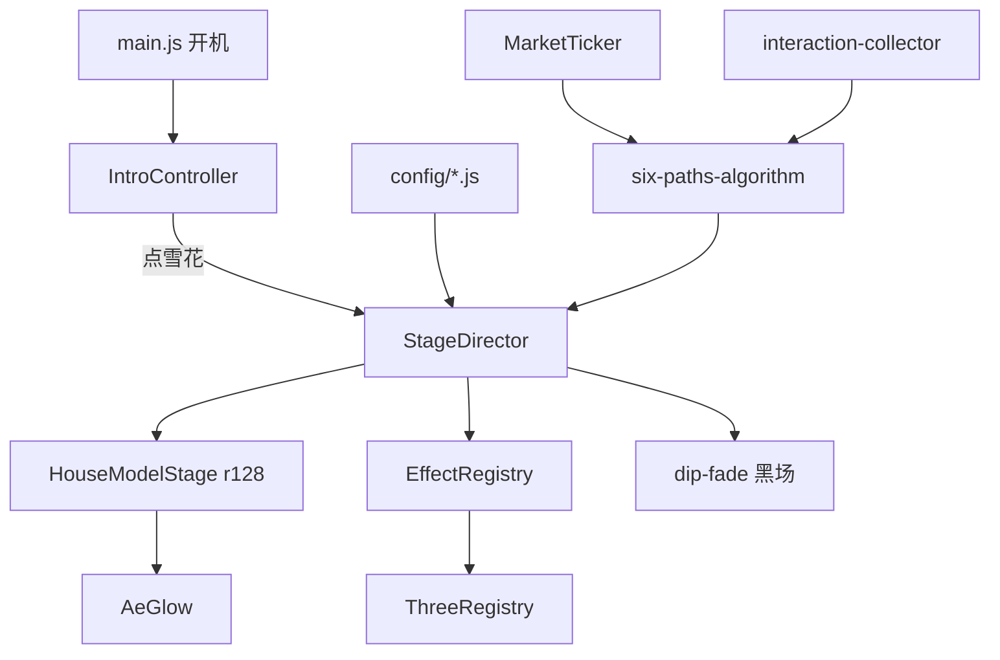

# 总览

给第一次打开仓库的人：这套程序用什么做成、文件在哪、启动顺序是什么、专题文档如何分工。算法细节不在本篇展开。

若你完全没有写过代码：先读 [从零在电脑上打开](./专题-从零在电脑上打开.md)，再读 [屏幕上看到什么、想改去哪](./专题-屏幕上看到什么.md)。本篇第 2、3 节（技术栈、模块图）可以后读。配套目录：[README](./README.md)。

---

## 0. 给非技术人员的词典

**浏览器：** 能显示网页的软件。本作品只在这里面跑，不另外安装播放器。

**JavaScript（脚本）：** 网页里的说明书，告诉浏览器「现在进入第几段、点了鼠标要记一笔、这一帧点往哪移」。本项目把说明书拆成几十个 `.js` 文件，用 `app/index.html` 按顺序加载。顺序错了，后面的说明书会找不到前面的名字。

**WebGL：** 浏览器里画三维的能力。房屋和多数六道特效走这条路。饿鬼走二维 canvas（p5）。触点球也是二维 canvas，但没用 p5 实例。

**CDN：** 网上现成的库地址。Three 本体和 p5 从 cdnjs 拉；房屋的 GLTFLoader、OrbitControls 从 jsDelivr 拉。没外网或墙了一家，房屋会挂。旧版 Three 文件在仓库 `reference/` 里，不靠 CDN。

**全局名字 `window.THREE`：** 可以想成舞台上只能放一块写着「THREE」的牌子。r128、r74、r76 都想当这块牌子。同一时刻只能有一个真身，所以要切换。详见版本隔离专题。

**分镜表：** `stages.config.js` 这一份列表。导演不「创作」，只按表执行。改秒数和**底部叙事台词**优先改表。开场标题、金刚经、终章大字不在这张表里，见「屏幕上看到什么」。

**配置文件：** 名字带 `config` 的 `.js`，里面大多是秒数、路径、台词。比 `house-model-stage.js` 这类「怎么画」的文件更适合先改。

**localhost：** 浏览器地址里的「这台电脑自己」，不是互联网。前面必须是 `http://`。

**端口（如 8080）：** 这台电脑上的门牌号。服务窗口关了，这个地址就打不开。

**缓存 / `?v=`：** 浏览器会把旧脚本记在手里。我们在文件名后面加 `?v=32` 这种数字，改文件时把数字加一，强迫它重新下载。

**无痕窗口：** Ctrl+Shift+N。不带昨天的缓存，适合确认「网上是不是还是旧的」。

**GitHub Pages：** 把这个文件夹放到网上、用 https 打开的免费托管。观众不用装 Python。你改完要推到 GitHub 才会更新线上。

**仓库：** 装这些文件的文件夹，通常还连着 GitHub。克隆或下载漏了 `assets/models/less_25mb.glb`，识那一段会一直转圈。

---

## 1. 这是什么工程

全屏网页装置。观众浏览器里跑完十五段；没有 Node 服务、没有数据库、没有打包器。GitHub Pages 托管静态文件。三维房屋、六道特效、业力归道都在客户端完成。行情来自币安公开 WebSocket。

必须用 `http://` 打开。双击 HTML（`file://`）时 GLB、字体、部分 fetch 会静默失败。

```bash
cd D:\NewProject
python -m http.server 8080
```

浏览器打开 `http://localhost:8080/app/index.html`。根目录 `index.html` 用脚本跳到 `app/index.html`，并带上 `?` 与 `#`。后面那条 `<meta refresh>` **不会**带参数，有 JS 时用不到。

不需要安装 npm、React、TypeScript。需要：现代浏览器（WebGL）、Python（仅本地静态服务）、能执行命令的终端。

---

## 2. 技术栈

| 层 | 选用 | 备注 |
|---|---|---|
| 页面 | HTML + CSS + 多文件 JS | `app/index.html` 按顺序 `<script>`，IIFE 挂 `window` |
| 三维主路径 | Three.js **r128** | `three.min.js` 在 cdnjs；GLTFLoader、OrbitControls 在 jsDelivr |
| 二维 / 环 | p5.js **1.4.0**（CDN） | 饿鬼道 |
| 旧 WebGL | 仓库内 Three **r74dev / r74 / r76** + TweenMax | 人、狱、畜、天 |
| 后处理 | 自写 `AeGlow` | 仿 AE Glow |
| 仪表边框 | DataV BorderBox1 的 vanilla 移植 | MIT |
| 音频 | `<audio>` + Web Audio 振荡器 | BGM 需用户手势后 play |
| 行情 | `wss://stream.binance.com:9443/ws/btcusdt@ticker` | 推一条算一次 |
| 托管 | GitHub Pages | 脚本用 `?v=N` 破缓存 |

未使用：Webpack/Vite、React/Vue、后端 API（币安除外）、Babylon。

核心难点不在「会不会用 Three」，而在 **同一页里多份互不兼容的 `window.THREE` 必须切换**。见 [版本隔离](./专题-版本隔离与特效接入.md)。

---

## 3. 模块关系



- **配置**决定每一段几秒、挂房屋还是特效、哪句台词。
- **导演**按表切换图层、等点击或等秒数、在「有」段触发 finalize。
- **房屋**是一条 r128 管线，用 `enterStageMode('chu'|'ai'|…)` 换算法。
- **特效**走统一 `mountXxx({ container }) → { dispose }`。
- **业力**只在后台记账；面板是显示器。公式见 [业力专题](./业力计算系统.md)。

---

## 4. 目录

```
app/index.html      图层 + 全部 script 顺序（改完 JS 记得 bump ?v=）
app/main.js         解析 URL、点雪花后启动导演
app/config/         分镜、路径、时间、资源、图表
app/core/           导演、总线、字幕、视频、阻塞门
app/house/          GLB 点云与各 mode
app/effects/        Three 开关、特效登记、Glow、黑场
app/karma/          采集、行情、算法、进度条
app/ui/             开场、经文、面板、光标、提示、终章
reference/          可 mount 的第三方视觉（含旧 Three 与图片）
assets/             glb / mp4 / ttf / mp3 / logo
docs/               本说明
app/preview/        实验室，不进主流程
```

`app/index.html` 的 script 顺序不能乱：先 config，再 karma，再 core，再 effects，再 house/ui，最后 director 与 `main.js`。

---

## 5. 开机与一段戏

`main.js`：读 `debug/stage/path/vedana/market/panel` → 初始化 UI → 正常则 `IntroController.enter()`。开场锁点击的那 2 秒已经开始网络预取 GLB。点雪花后：采集 start、行情 start、解锁 AudioContext、解析房屋、`StageDirector.init({ startIndex: 1 })`。

每一段导演做同一套事：改图层可见性 → `ensureProfile` → 有房屋则 `enterStageMode`、没有则藏层（六道才 `suspend` 停房屋循环）→ 如有 `layers.effect` 则 `EffectRegistry.mount` → 播字幕 → 阻塞或计时或 `KarmaProgress.runFinalize`。

十五段：0 开场点击 → 1 经文 → 2 触点球 → 3–9 房屋（识溶六入触受爱取）→ 10 业力条 → 11 六道特效 → 12–13 生/老死点云 → 14 终章。字段与阻塞见 [舞台导演](./专题-舞台导演与配置.md) 第 8 节表。房屋身法见 [房屋点云](./专题-房屋点云.md)。

---

## 6. 画面三条路

1. **星空 video** 一直 loop；六道段 opacity 0 但仍解码，避免切回来卡第一帧。
2. **房屋 WebGL**：透明清屏，透出 video。点云 Shader + 部分模式每帧改顶点。Glow 只打在点上，识的实体网格关掉。
3. **特效层 `#effectLayer`**：触点球、六道 embed。与房屋尽量不同时抢画面；六道结束用黑场再切「生」。

触点球是 Canvas 2D 排斥球，不是 p5 实例。registry 仍标了 `threeProfile: 'p5'`，进 Stage 2 就会把 p5.js 从 CDN 拉下来（饿鬼稍后能复用）。饿鬼是真 p5，再套一层与房屋相同的 Glow。

---

## 7. 数据两条线

点雪花到进度条 100%：

- 币安每包 → Vol / Turn / Stab → 加权随机记入某一道的秒数。
- 鼠标点击/移动/滚轮（转房屋算 Look，不进混乱）。

结算：\(\mathrm{score}=M+0.45U\)，最高者挂六道视觉。「受」只用偷看，可以和最终道不同。详见业力专题。

---

## 8. 改什么动哪

| 改 | 文件 |
|---|---|
| 台词、秒数、等不等点击 | `config/stages.config.js`（仅底部叙事；标题/经文/终章见「屏幕上看到什么」） |
| 开场标题 | `ui/intro-controller.js` 的 `INTRO_TEXT` |
| 金刚经、终章大字、彗星提示 | `app/index.html` 对应段落 |
| 六道 HUD 两句英文壳 | `ui/path-resolution-hud.js` 的 `show()`（不要只改 HTML） |
| 六道用哪套视觉、苦乐舍文案 | `config/paths.config.js` |
| 开场锁点击、经文停多久、字幕淡化 | `config/timing.config.js`（提示闪烁不在这里，在 CSS `hintPulse`） |
| 模型 / BGM / 流通量 / 交易对 | `config/assets.config.js`（换交易对应同时改算法分母，见业力专题） |
| 三套字体路径 | `styles/main.css` 的 `@font-face`（NITEMARE / Pixelate / 方正） |
| 点颜色、爱的弹簧 | `house/house-model-stage.js` 顶部常量 |
| Glow 阈值半径 | `effects/ae-glow.js` `DEFAULTS` |
| 归道权重、α | `karma/six-paths-algorithm.js` |
| 新特效 | `reference/<名>/` + `effect-registry.js` + `PATHS_CONFIG` |
| 线上仍是旧文件 | `app/index.html` 对应 `?v=` 加一 |

排障与调试 URL 见 [发布调试与排障](./专题-发布调试与排障.md)。怎么 push 见 [把改动放到网上](./专题-把改动放到网上.md)。

---

## 9. 专题怎么读

按任务选，不必按编号读完：

- 要接一段新画面、改等待点击 → 舞台导演
- 点怎么动、溶解、球面 → 房屋点云
- 光晕发糊、黑场叠帧 → 辉光与黑场
- 黑屏无报错、THREE 错乱 → 版本隔离
- 某一道画面从哪来 → 六道视觉
- 为什么进了人道/修罗 → 业力计算
- 右上角饼图在跳、会不会就是最终道 → 右上角仪表
- 展场没网、Pages 缓存 → 发布排障
- 本地对了、网上还是旧的 → 把改动放到网上
- 电脑上第一次怎么开 → 从零在电脑上打开
- 屏幕上的字到底在哪个文件 → 屏幕上看到什么
- 标题、经文、台词条、光标 → 开场字幕与界面
- 无声、缺文件、天道黑屏查哪张图 → 声音与必须存在的文件
- 转房子会不会进畜生、点了算不算 → 鼠标如何被记账
- 能不能用平板、显卡够不够、有没有上传观众 → 展场与设备限制
- 改完怎么验收、实验室页在哪 → 预览页与验收
- 字体和 Mixkit 能不能公开仓库 → 素材版权与授权

读文档的顺序建议：从零打开 → 屏幕上看到什么 →（需要时）本总览 → 你要改的那一块专题。不要指望一篇写尽着色器和币安公式。零基础改字，不必先读技术栈。
